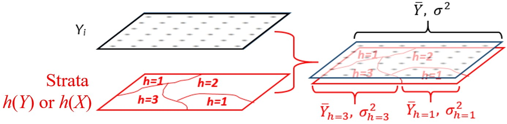
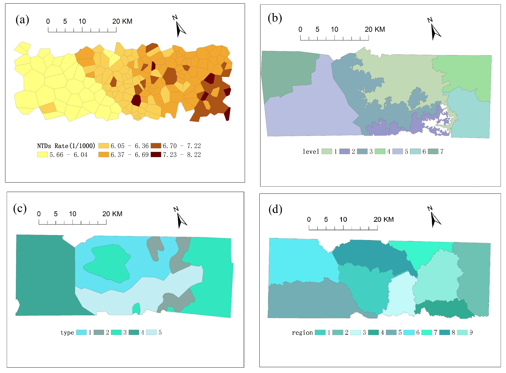

```{r, echo=FALSE }
knitr::opts_chunk$set(error = TRUE, warning=FALSE, message=FALSE, fig.path='figs/')
library("geodetector")
data(CollectData)
```


#	Geodetector method
Spatial stratified heterogeneity (SSH), referring to the within strata are more similar than the between strata, such as landuse types and climate zones, is ubiquitous in spatial data. SSH instead of random is a set of information, which has been being a window for humans to understand the nature since Aristotle time. In another aspect, a model with global parameters would be confounded if input data is SSH, the problem dissolves if SSH is identified so simple models can be applied to each stratum separately. Note that the “spatial” here can be either geospatial or the space in mathematical meaning. 

Geodetector is a novel tool to investigate SSH: (1) measure and find SSH of a variable *Y* ; (2) test the power of determinant *X* of a dependent variable *Y* according to the consistency between their spatial distributions; and (3) investigate the interaction between two explanatory variables *X<sub>1</sub>* and *X<sub>2</sub>* to a dependent variable *Y*. All of the tasks are implementable by the geographical detector *q*-statistic:
\begin{equation}
q=1- \frac{1}{N\sigma^2}\sum_{h=1}^{L}N_h\sigma_h^2
\end{equation}

where *N* and *&sigma;<sup>2</sup>* stand for the number of units and the variance of *Y* in study area, respectively;  the population *Y* is composed of *L* strata (*h* = 1, 2, …, *L*), *N<sub>h</sub>* and *&sigma;<sub>h</sub><sup>2</sup>* stand for the number of units and the variance of *Y* in stratum *h*, respectively. The strata of *Y* (red polygons in Figure 1) are a partition of *Y*, either by itself ( *h(Y)* in Figure 1) or by an explanatory variable *X* which is a categorical variable ( *h(Y)* in Figure 1). *X* should be stratified if it is a numerical variable, the number of strata *L* might be 2-10 or more, according to prior knowledge or a classification algorithm.




(Notation: *Yi* stands for the value of a variable *Y* at a sample unit *i* ; *h(Y)* represents a partition of *Y* ; *h(X)* represents a partition of an explanatory variable *X*. In geodetector, the terms “stratification”, “classification” and “partition” are equivalent.)

Interpretation of *q* value (please refer to Fig.1). The value of *q* &in; [0, 1]. 

If *Y* is stratified by itself *h(Y)*, then *q* = 0 indicates that *Y* is not SSH; *q* = 1 indicates that *Y* is SSH perfectly; the value of *q* indicates that the degree of SSH of *Y* is *q*.

If *Y* is stratified by an explanatory variable *h(X)*, then *q* = 0 indicates that there is no association between *Y* and *X* ; *q* = 1 indicates that *Y* is completely determined by *X* ; the value of *q*-statistic indicates that *X* explains 100*q*% of *Y*. Please notice that the *q*-statistic measures the association between *X* and *Y*, both linearly and nonlinearly.

For more detail of Geodetector method, please refer:

[1] Wang JF, Li XH, Christakos G, Liao YL, Zhang T, Gu X, Zheng XY. Geographical detectors-based health risk assessment and its application in the neural tube defects study of the Heshun Region, China. International Journal of Geographical Information Science, 2010, 24(1): 107-127.

[2] Wang JF, Zhang TL, Fu BJ. A measure of spatial stratified heterogeneity. Ecological Indicators,2016, 67(2016): 250-256.

[3] Wang JF, Xu CD. Geodetector:Principle and prospective. Geographica Sinica,2017,72(1):116-134.

# R package for geodetector
geodetector package includes five functions: factor_detector, interaction_detector, risk_detector, ecological_detector and geodetector. The first four functions implementing the calcution of factor detector, interaction detector, risk detector and ecological detector, which can be calculated using table data, e.g. csv format(Table 1). The last function geodetector is an auxiliary function, which can be used to implement the calculation for shapefile format map data(Figure 2).

```{r table1 ,echo = FALSE}
  knitr::kable(
  head(CollectData[, 1:4], 6), booktabs = TRUE,
  caption = 'Table 1. Demo data in table format'
)
```

geodetector package depends on the following packages: rgeo, sp, maptools and rgdal, which should be installed in advance.


As a demo, neural-tube birth defects (NTD) *Y* and suspected risk factors or their proxies *Xs* in villages are provided, including data for the health effect GIS layers and environmental factor GIS layers, “elevation”, “soil type”, and “watershed”.


```{r image2, echo = FALSE, out.width='100%', fig.cap="Figure 2. Demo data in GIS format (a) NTDs prevalence *Y*, (b) Elevation *X<sub>1</sub>*, (c) Soil types *X<sub>2</sub>*, (d) Watersheds *X<sub>3</sub>*"}

```


After download of geodetector package, using install.packages function to install it.

```{r, eval=F}
install.packages("geodetector")
```


Load package:

```{r}
library(geodetector)
```
Read data in table format:

```{r}
data(CollectData)
```

Data class:
```{r}
class(CollectData)
```

Field names:
```{r}
names(CollectData)
```

## 1	Factor detector

The factor detector q-statistic measures the SSH of a variable *Y*, or the determinant power of a covariate *X* of *Y*. 

factor_detector implement the function of factor detector. In the following demo, the first parameter "incidence" represent explained variable, the second parameter "elevation" represent explanatory variable, and the third parameter” CollectData" represent dataset.

The output of the function include q statistic and the corresponding p value.

```{r}
factor_detector("incidence","elevation",CollectData) 
```

Another way also can be used to implement the function, in which the input parameters can be the index of each field. For example, in the following demo, the first parameter "1" represent explained variable in the first column of the dataset, the second parameter "3" represent explanatory variable in the third column of the dataset.

```{r}
factor_detector(1,3, CollectData)
```

If there are more than one variable, the function can be used as the following. In which, c("soiltype","watershed","elevation") or c(2,3,4) are field names and index of field for explanatory variables in columns 2, 3, 4, respectively.

```{r, eval=F}
factor_detector ("incidence",c("soiltype","watershed","elevation"),CollectData)
```
or

```{r}
factor_detector (1,c(2,3,4), CollectData)
```

## 2	Interaction detector
The interaction detector reveals whether the risk factors *X<sub>1</sub>* and *X<sub>2</sub>* (and more *X*) have an interactive influence on a disease *Y*. 

The function interaction_detector implement the interaction detector. In the following demo, the first parameter "incidence" represent explained variable, the second parameter c("soiltype","watershed","elevation") represent explanatory variables, and the third parameter "CollectData" represent dataset.

```{r}
interaction_detector("incidence",c("soiltype","watershed","elevation"),CollectData)
```

## 3	Risk detector
The risk detector calculates the average values in each stratum of explanatory variable (*X*), and presents if there exists difference between two strata.

The function risk_detector implement the risk detector. In the following demo, the first parameter "incidence" represents explained variable, the second parameter "soiltype" represents explanatory variables, and the third parameter "CollectData" represent dataset.

In the function, result information for each variable is presented in two parts. 

The first part gives the average value of explained variable in each stratum of a explanatory variables. 

The second part tests whether there are significant difference between the means of two strata; if there is a significant difference (t test with significant level of 0.05), the corresponding value is “TRUE ”, else it is “FALSE”.

```{r}
risk_detector("incidence","soiltype",CollectData)
```

Another way also can be used to implement the function, in which the input parameters can be the index of each field. For example, in the following demo, the the first parameter "1" represent explained variable in the first column of the dataset, the second parameter "2" represent explanatory variable in the second column of the dataset.

```{r}
risk_detector(1,2, CollectData)
```

If there are more than one variable, the function can be used as the following. In which, c("soiltype","watershed","elevation") and c(2,3,4) are field names and index of field for explanatory variables.

```{r, eval=F}
risk_detector("incidence",c("soiltype","watershed","elevation"),CollectData)
```

or 

```{r}
risk_detector(1,c(2,3,4), CollectData)
```

## 4	Ecological detector
The ecological detector tests whether there is significant differences between two risk factors *X<sub>1</sub>* ~ *X<sub>2</sub>*.

The function ecological_detector implement the ecological detector. In the following demo, the first parameter "incidence" represents explained variable, the second parameter c("soiltype","watershed") represents explanatory variables, and the third parameter "CollectData" represent dataset. In the function, the F statistic is used to test the difference with the significant level of 0.05.

```{r}
ecological_detector("incidence",c("soiltype","watershed"),CollectData)
```

If there are more than two variables, the function can be used as the following. 
```{r}
ecological_detector("incidence",c("soiltype","watershed","elevation"),CollectData)
```

where, c("soiltype","watershed","elevation") are field names of field for explanatory variables.

## 5	Transform data from map to table format

If the input data is in table format, it can be directly used as input parameters in the above functions. However, if input data is map in shapefile format, the function named geodetector can be used to transform from shapefile map to table format, then the above function can be used. Please note that, these shapefile layers should have the same projected coordinate system.

Load maptools package:

```{r}
library(sp)
library(rgeos)
library(maptools)
```

Read data:

```{r}
data(DiseaseData_shp)
data(SoilType_shp)
data(Watershed_shp)
data(Elevation_shp)
```

In the following demo, the first parameter "DiseaseData_shp" represents shape file data storing explained variable, the second parameter c(SoilType_shp, Watershed_shp, Elevation_shp) represents shape file data storing explanatory variables, and the third parameter c('incidence', 'soiltype', 'watershed', 'elevation') represent field names used in calculation in explained variable and explanatory variables, respectively.


```{r}
CollectData2 <- maps2dataframe(DiseaseData_shp,c(SoilType_shp, Watershed_shp, 
                              Elevation_shp),namescolomn= c('incidence', 
                               'soiltype', 'watershed', 'elevation'))

head(CollectData2)
```

Using dataset CollectData calculated from maps2dataframe function, the following function can be calculated.

Risk detector:

```{r}
risk_detector("incidence","soiltype",CollectData2)
risk_detector("incidence",c("soiltype"),CollectData2)

risk_detector(1,2,CollectData2)
risk_detector(1,c(2,3,4),CollectData2)
``` 

factor detector:
```{r}
factor_detector("incidence","elevation",CollectData2)
factor_detector ("incidence",c("elevation","watershed"),CollectData2)

factor_detector(1,3,CollectData2)
factor_detector (1,c(2,3,4),CollectData2)
``` 

ecological detector:
```{r}
ecological_detector("incidence",c("soiltype","watershed"),CollectData2)
ecological_detector("incidence",c("soiltype","watershed","elevation"),CollectData2)
``` 

interaction detector:
``` {r}
interaction_detector("incidence",c("soiltype","watershed"),CollectData2)
interaction_detector("incidence",c("soiltype","watershed","elevation"),CollectData2)
```

## 6	Output

The result of factor detector function or risk detector function can be saved as one CSV file, for example: 

```{r, eval=F}
Result_1 <- factor_detector ("incidence",c("soiltype","watershed", "elevation"),CollectData)
write.csv(Result_1 [[1]],'./Geodetector_R/
          output_factor_detector_soiltype.csv') 
write.csv(Result_1 [[2]],'./Geodetector_R/
          output_factor_detector_watershed.csv') 
write.csv(Result_1 [[3]],'./Geodetector_R/
          output_factor_detector_elevation.csv') 

Result_2 <- risk_detector("incidence",c("soiltype","watershed"),
                          CollectData)
write.csv(Result_2 [[1]][1],'./Geodetector_R/
          output_risk_detector_soiltype_Mean.csv') 
write.csv(Result_2 [[1]][2],'./Geodetector_R/
          output_risk_detector_soiltype_Significance.csv') 
write.csv(Result_2 [[2]][1],'./Geodetector_R/
          output_risk_detector_watershed_Mean.csv') 
write.csv(Result_2 [[2]][2],'./Geodetector_R/
          output_risk_detector_watershed_Significance.csv') 
```

The result of interaction detector function or ecological detector function also can be saved as CSV file, for example: 
```{r, eval=F}
Result_3 <- interaction_detector("incidence",c("soiltype","watershed",
                                               "elevation"),CollectData)
write.csv(Result_3,'./Geodetector_R/
          output_interaction_detector.csv') 

Result_4 <- ecological_detector("incidence",c("soiltype","watershed"),
                                CollectData)
write.csv(Result_4,'./Geodetector_R/
          output_ecological_detector.csv') 
```
